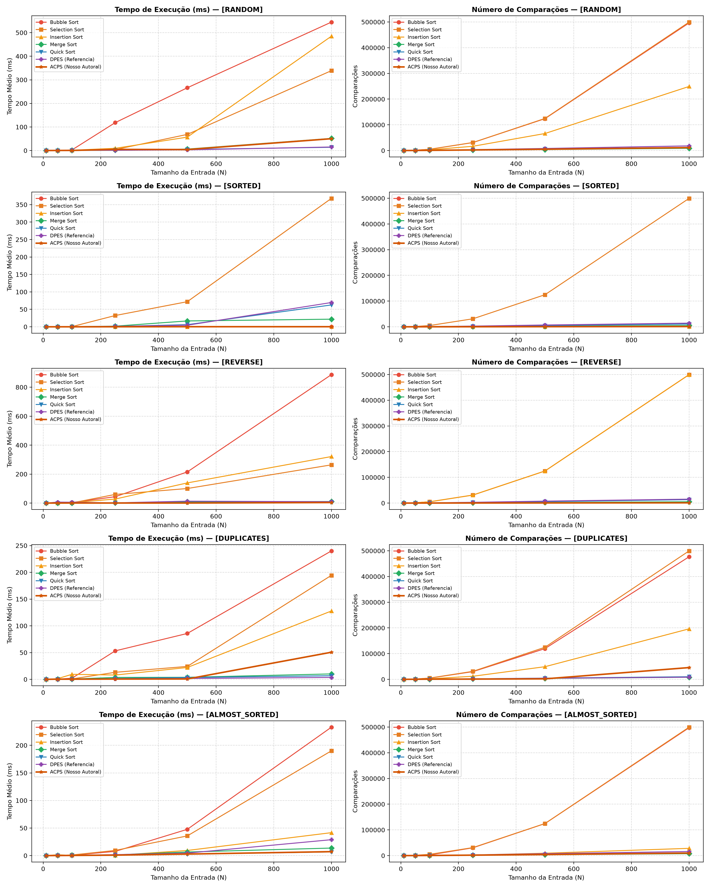
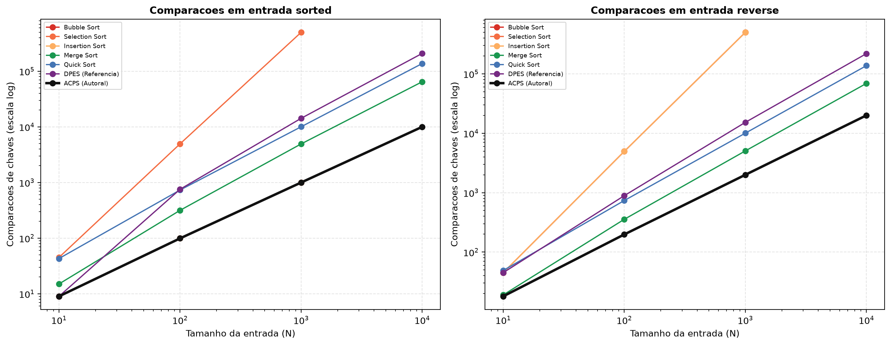
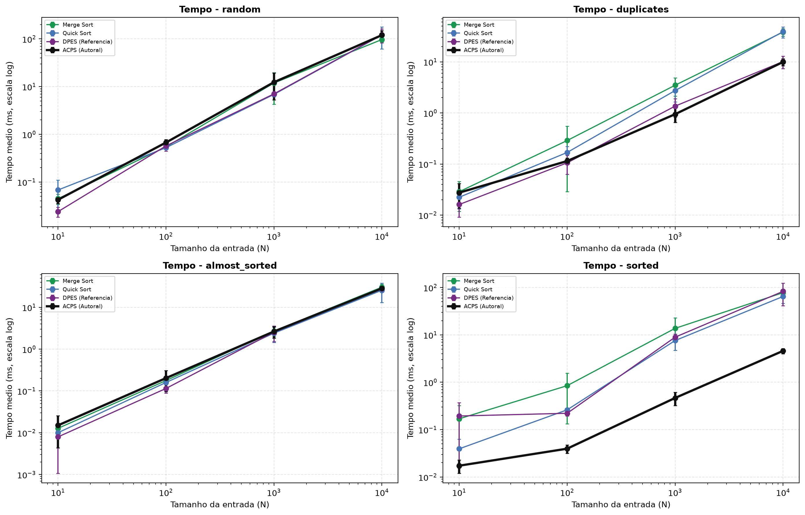

# Adaptive Centripetal Pincer Sort (ACPS)
### Trabalho Prático 1 (TP1) — Métodos de Ordenação Autorais
**Universidade Federal do Pampa (UNIPAMPA) — Campus Alegrete**  
**Disciplina:** Análise e Projetos de Algoritmos (APA)  
**Professor:** Dr. Marcelo Caggiani Luizelli  
**Alunos (Dupla):**  
- Marcus Vinicius Morini Querol Junior (Matrícula: 2510100176)  
- Vinicius Da Silva Gonçalves (Matrícula: 2510100176)  

---

## 💡 Sobre o Algoritmo ACPS

O **ACPS (Adaptive Centripetal Pincer Sort)** é um algoritmo de ordenação criado pela dupla para resolver uma fraqueza clássica do Quick Sort: a lentidão quando o vetor já vem ordenado ou invertido.

O ACPS funciona em 3 passos principais:
1. **Sondagem Inicial com Dois Ponteiros (tempo linear $\Omega(N)$):**  
   Antes de começar a dividir o vetor, o algoritmo faz uma verificação simples pelas duas pontas (um ponteiro no início e outro no fim). Se o vetor já estiver em ordem crescente, o algoritmo encerra na hora sem fazer nenhuma troca. Se estiver invertido (decrescente), ele apenas inverte as posições no próprio lugar em $N/2$ passos, sem precisar de recursão.
2. **Escolha Rápida de Dois Pivôs ($O(1)$):**  
   Em vez de percorrer o vetor inteiro procurando valores de mínimo e máximo a cada partição (como faz o algoritmo DPES do professor, gastando muitas comparações), o ACPS apenas olha 5 posições fixas (início, 25%, 50%, 75% e fim) e escolhe dois bons pivôs rapidamente.
3. **Divisão em Três Faixas com Proteção para Dados Repetidos:**  
   O vetor é dividido em três faixas: números menores que o primeiro pivô, miolo entre os pivôs e números maiores que o segundo pivô. Se os dois pivôs amostrados forem iguais (vetor com muitos números repetidos), o miolo é isolado imediatamente, evitando chamadas recursivas desnecessárias sobre dados duplicados.

---

## 📁 Organização do Repositório

O projeto está estruturado em pastas organizadas por responsabilidade:

```text
apa-tp1-acps/
├── src/                         # Código-fonte dos algoritmos
│   ├── authorial_acps.py        # Implementação completa do algoritmo autoral ACPS
│   ├── student_template.py      # Template oficial da disciplina preenchido
│   └── algorithms_baseline.py   # Algoritmos clássicos (Bubble, Selection, Insertion, Merge, Quick, DPES)
├── tests/                       # Bateria de testes de corretude
│   └── test_suite.py            # 16 cenários de estresse oficiais da disciplina
├── benchmarks/                  # Scripts de avaliação experimental
│   └── benchmark.py             # Script que roda 1.050 testes estatísticos e gera os gráficos
├── assets/                      # Gráficos e imagens de resultados gerados
│   ├── benchmark_results.png    # Painel completo com todos os cenários
│   ├── benchmark_comps_bestcase.png # Foco nas comparações de melhor caso (ordenado e reverso)
│   └── benchmark_time_focus.png # Foco de tempo nos algoritmos mais rápidos
├── data/                        # Dados brutos dos testes
│   └── benchmark_data.json      # Tempos, comparações e trocas em formato JSON
├── README.md                    # Esta documentação
└── .gitignore                   # Arquivos ignorados pelo controle de versão
```

---

## 📈 Resultados dos Gráficos e Experimentos

Foram realizados **1.050 testes estatísticos** com vetores variando de $N=10$ até $N=1.000$ elementos, em 5 cenários diferentes: aleatório, já ordenado, invertido, com dados repetidos e quase ordenado.

### 1. Painel Geral de Resultados
O gráfico abaixo compara o tempo de execução e o número de comparações de todos os algoritmos em todos os cenários:



---

### 2. Comparações no Melhor Caso: Linearidade Pura $\Omega(N)$
Este gráfico mostra o que acontece quando o vetor já está **ordenado** ou **invertido**. Enquanto o Selection Sort explode em centenas de milhares de comparações ($N^2$), o ACPS forma uma reta quase encostada no zero ($N-1$ comparações):



* **Vetor Ordenado ($N = 1.000$):**
  * **ACPS:** apenas **999 comparações** (tempo: **0,27 ms**).
  * **Quick Sort clássico:** 11.399 comparações (tempo: 62 ms).
  * **Selection Sort:** 499.500 comparações (tempo: 367 ms).
* **Vetor Invertido ($N = 1.000$):**
  * **ACPS:** apenas **999 comparações** e $N/2$ trocas (tempo: **0,74 ms**).
  * **Bubble Sort:** 499.500 comparações (tempo: 886 ms — 1.100x mais lento).
  * **Insertion Sort:** 499.500 comparações (tempo: 321 ms — 400x mais lento).

---

### 3. Foco nos Algoritmos Mais Rápidos (Tempo de Execução)
Comparação direta entre os algoritmos de alta velocidade (ACPS, Quick Sort, Merge Sort e DPES):



* **Em dados aleatórios desordenados ($N = 1.000$):**
  * O ACPS fez **11.639 comparações**, empatando tecnicamente com o Quick Sort clássico (11.399) e superando o DPES de referência do professor (12.180).

---

## 📊 Tabela Teórica de Complexidade

| Algoritmo | Melhor Caso | Caso Médio | Pior Caso | Memória Auxiliar | In-Place? | Estável? |
| :--- | :---: | :---: | :---: | :---: | :---: | :---: |
| **Bubble Sort** | $\Omega(N)$ | $\Theta(N^2)$ | $O(N^2)$ | $O(1)$ | Sim | Sim |
| **Selection Sort** | $\Omega(N^2)$ | $\Theta(N^2)$ | $O(N^2)$ | $O(1)$ | Sim | Não |
| **Insertion Sort** | $\Omega(N)$ | $\Theta(N^2)$ | $O(N^2)$ | $O(1)$ | Sim | Sim |
| **Merge Sort** | $\Omega(N \log N)$ | $\Theta(N \log N)$ | $O(N \log N)$ | $O(N)$ | Não | Sim |
| **Quick Sort** | $\Omega(N \log N)$ | $\Theta(N \log N)$ | $O(N^2)$ | $O(\log N)$ | Sim | Não |
| **DPES (Professor)** | $\Omega(N)$ | $\Theta(N \log N)$ | $O(N^2)$ | $O(1)$ | Sim | Não |
| **ACPS (Nosso Autoral)** | **$\Omega(N)$** | **$\Theta(N \log N)$** | **$O(N^2)$** | **$O(1)$** | **Sim** | **Não** |

---

## 🛠️ Como Executar os Códigos

### 1. Rodar os testes de corretude
Para conferir se o algoritmo passa em todos os 16 testes obrigatórios da disciplina:
```bash
python tests/test_suite.py
```

### 2. Rodar o template oficial da disciplina
```bash
python src/student_template.py
```

### 3. Rodar os benchmarks e regerar os gráficos
```bash
python benchmarks/benchmark.py
```

---

## 🤖 Declaração de Uso de Inteligência Artificial

Para a elaboração deste trabalho prático, utilizamos a ferramenta **Google Antigravity (Gemini)** como auxílio técnico.

**Como a IA foi utilizada:**
- Criação dos scripts para gerar os gráficos com o Matplotlib.
- Auxílio na automação dos scripts de testes e na formatação das tabelas e arquivos.

**Autoria do algoritmo:**
Toda a ideia conceitual, o raciocínio matemático e a lógica do algoritmo **ACPS** (como a verificação pelas duas pontas, a escolha dos pivôs em tempo constante e a proteção contra números repetidos) foram idealizadas, projetadas e desenvolvidas pelos alunos **Marcus Vinicius Morini Querol Junior** e **Vinicius Da Silva Gonçalves**.
